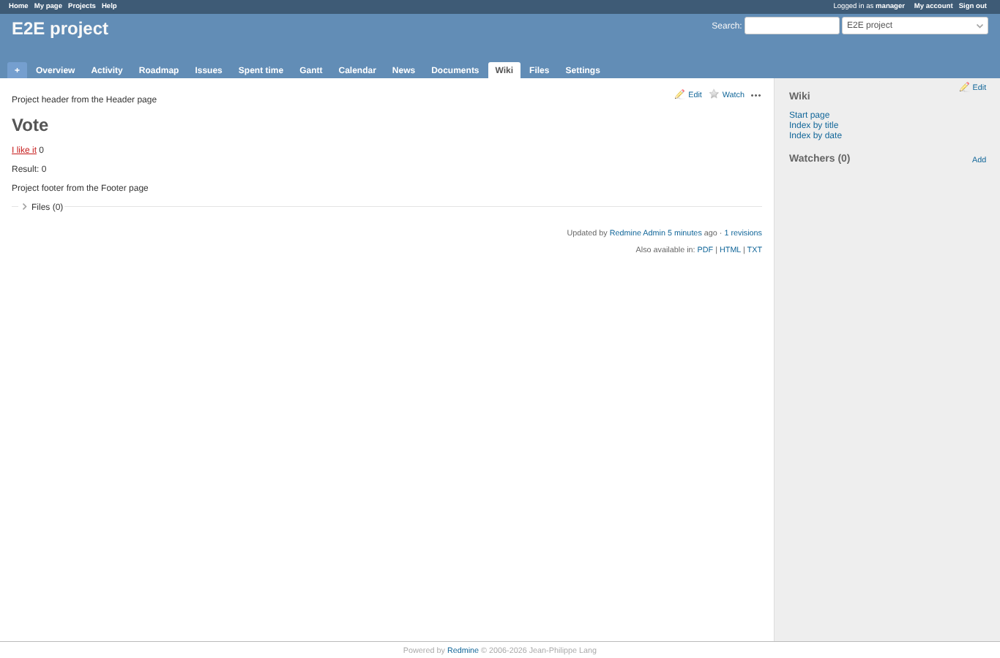
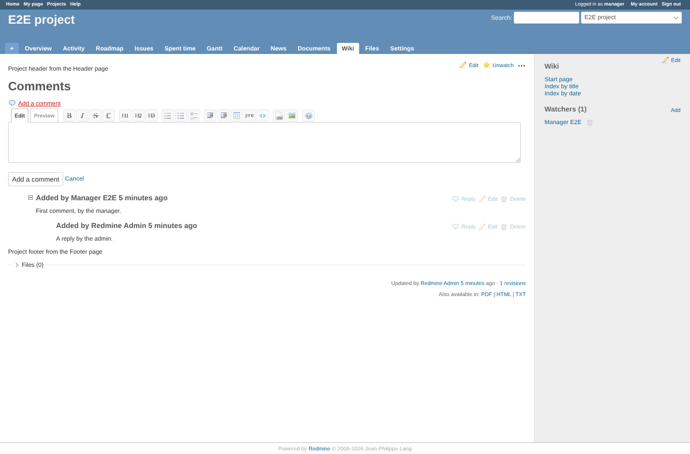
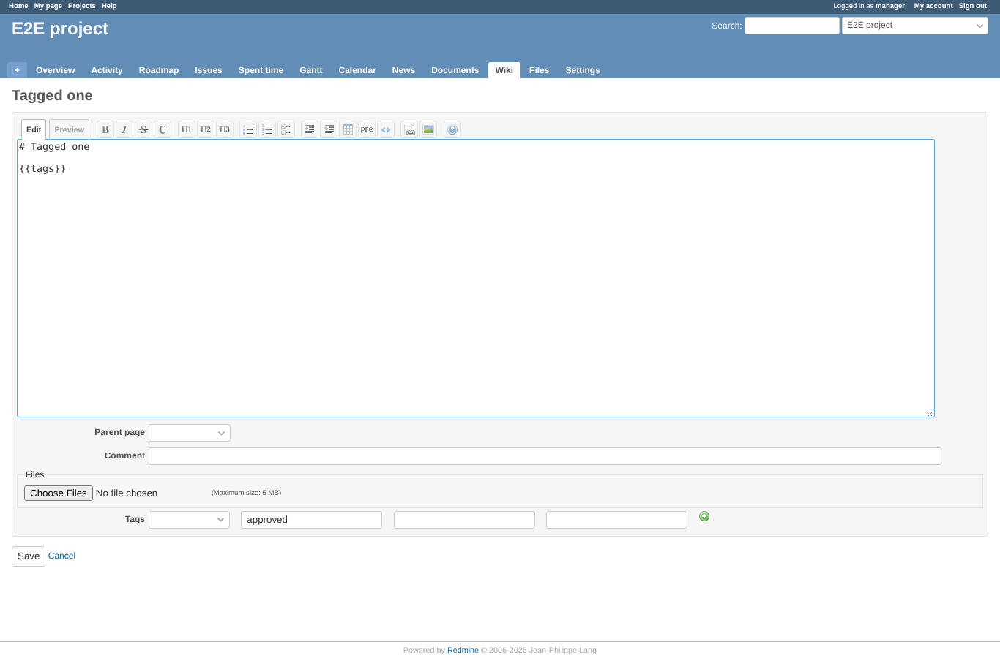
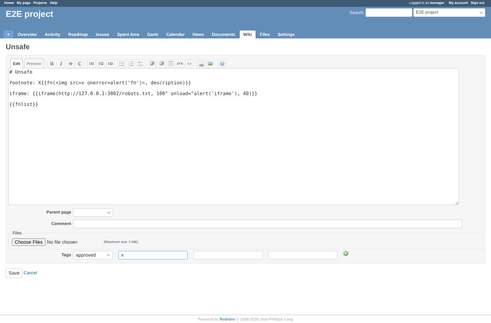
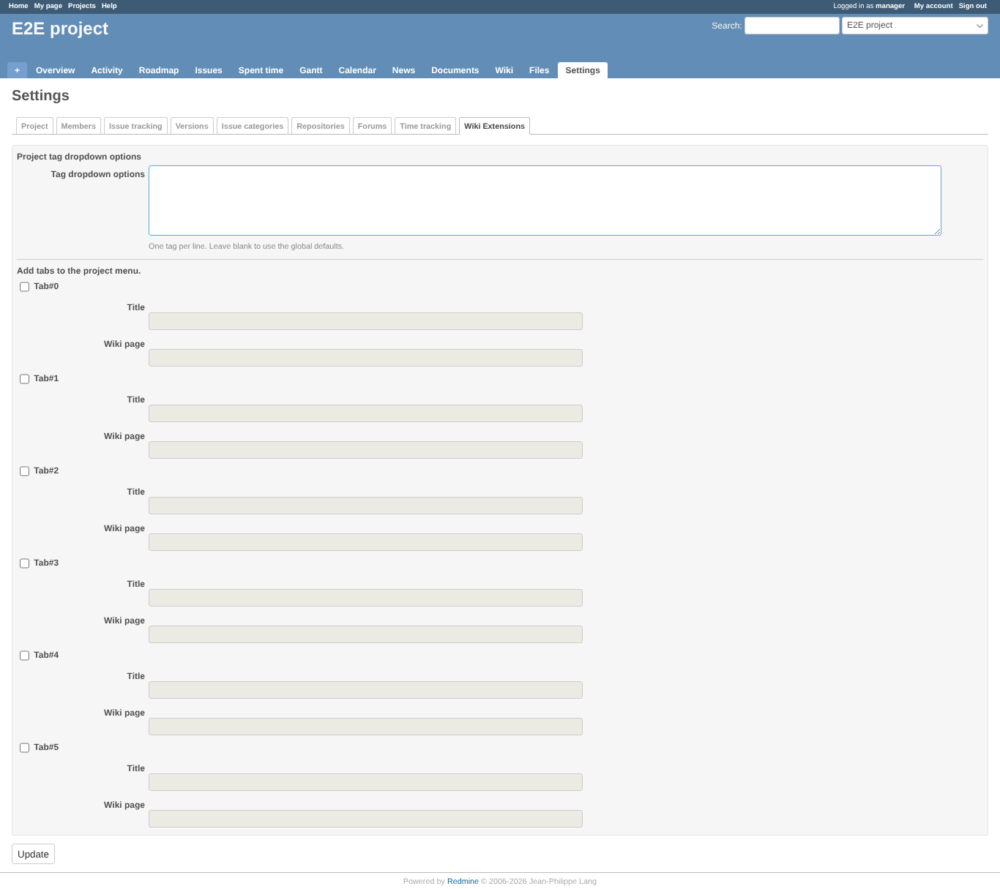
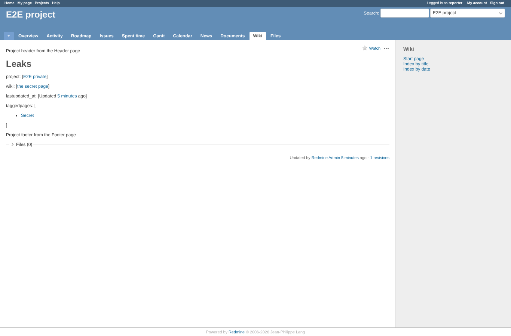
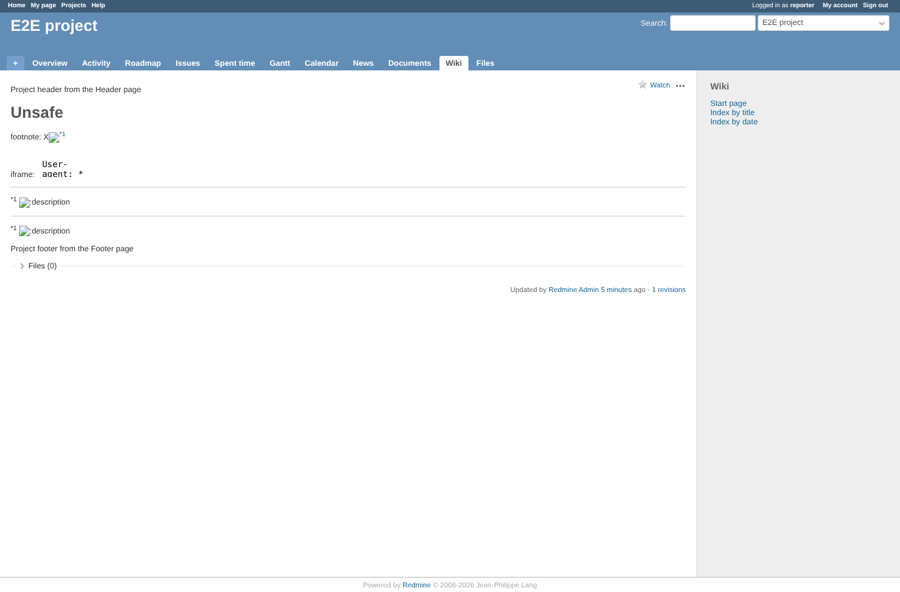

# before

Run 2026-10-06T20:42:26.614Z against http://127.0.0.1:3002.

| screenshot | user | URL | shows |
|---|---|---|---|
|  | manager | `/projects/e2e-project/wiki/Vote` | Before: clicking "I like it" sends GET and gets HTTP 404; the count does not change |
|  | manager | `/projects/e2e-project/wiki/Comments` | Before: the comment form from {{comment_form}} (toolbar elements: 1; JS: no error) |
|  | manager | `/projects/e2e-project/wiki/Tagged_one/edit` | Before: Tagged_one carries "alpha" and "approved"; the dropdown shows "" (blank: saving would delete "alpha") |
|  | manager | `/projects/e2e-project/wiki/Unsafe/edit` | Before: the tag x" onfocus="alert('tag')" autofocus=" becomes attributes of its input (onfocus handlers: 1; dialogs: tag) |
|  | manager | `/projects/e2e-project/settings/wiki_extensions` | Before: after one GET of forward_wiki_page without menu_id the settings list Tab#0, Tab#1, Tab#2, Tab#3, Tab#4, Tab#5 |
|  | reporter | `/projects/e2e-project/wiki/Leaks` | Before: reporter (no member of e2e-private) sees the private project name, a link to its Secret page, its update time and its tagged page |
|  | reporter | `/projects/e2e-project/wiki/Unsafe` | Before: the footnote word and the iframe width run script for the reader (dialogs: fn, fn, fn, iframe) |
