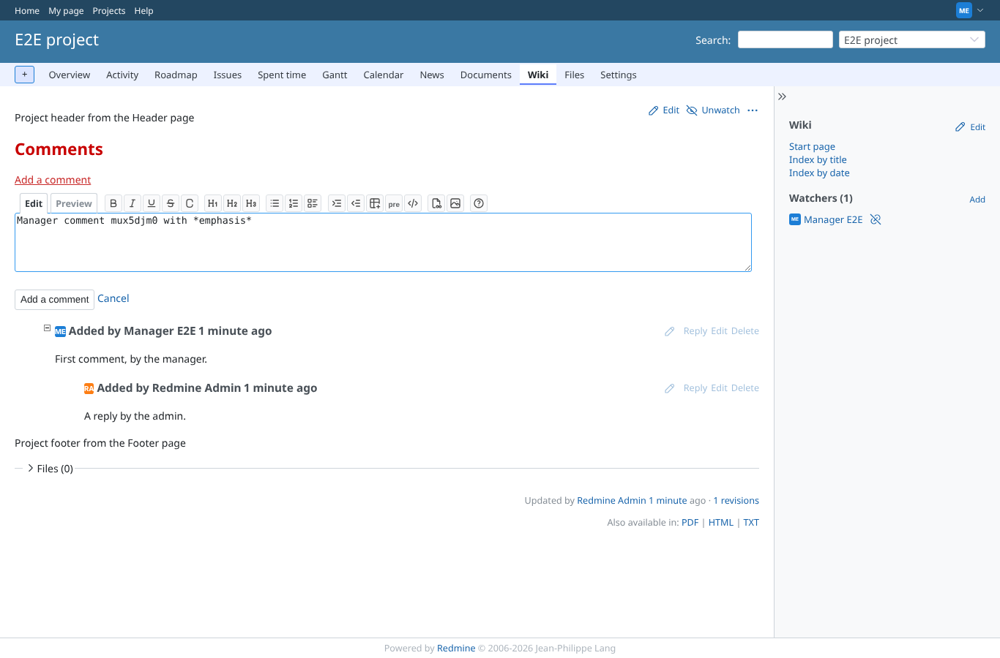
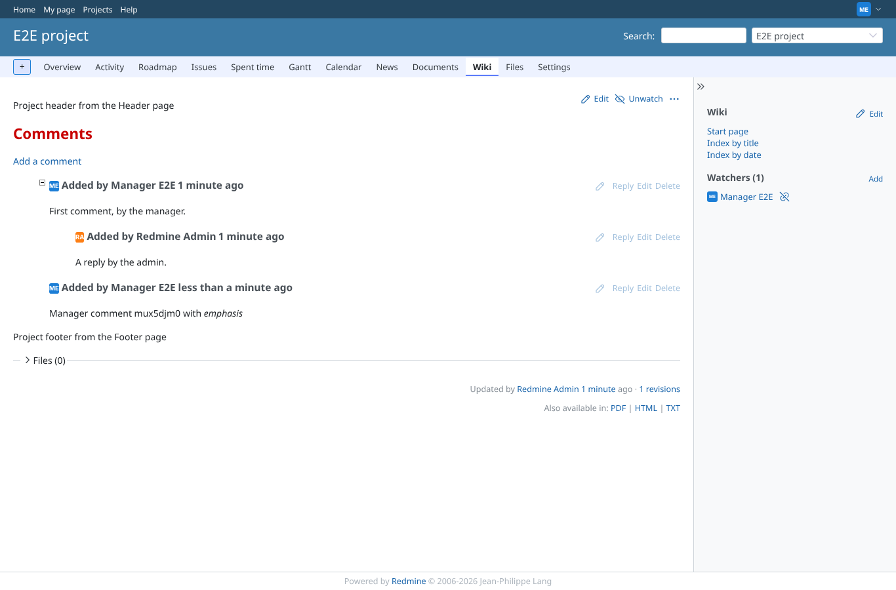
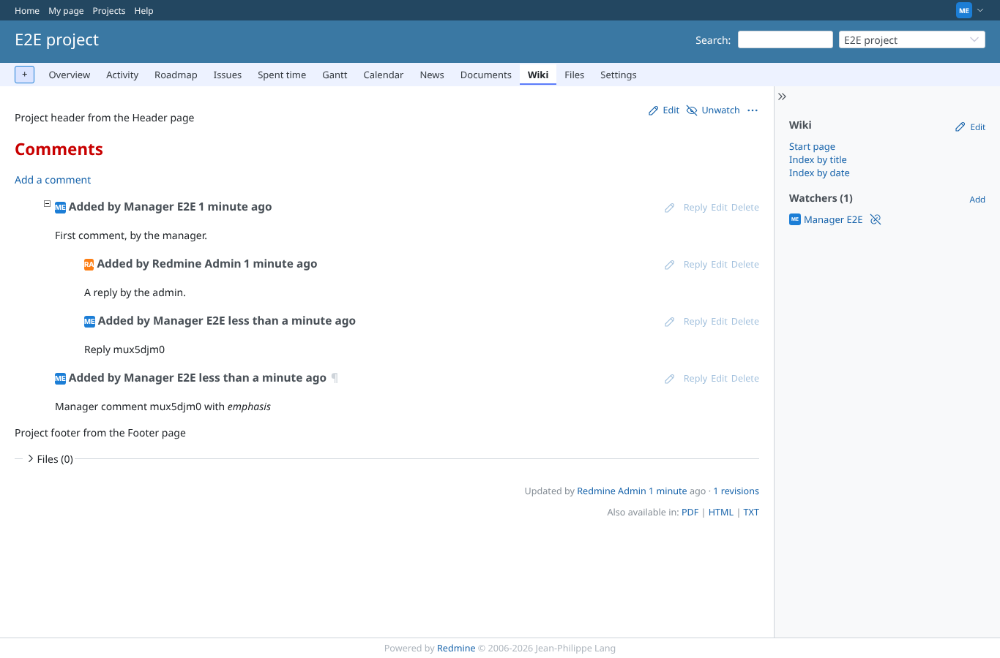
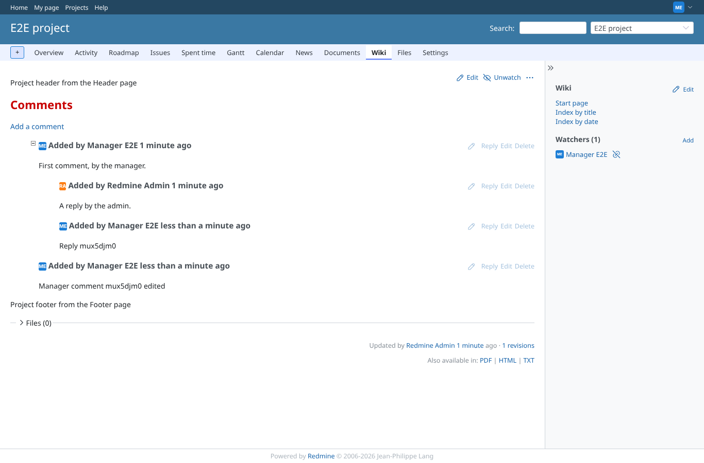
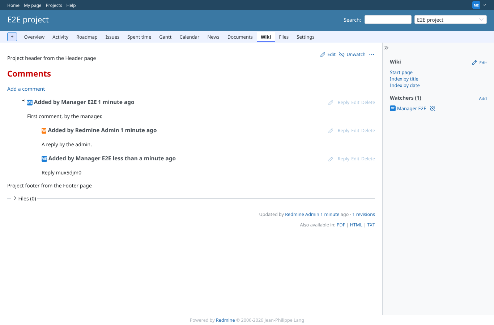
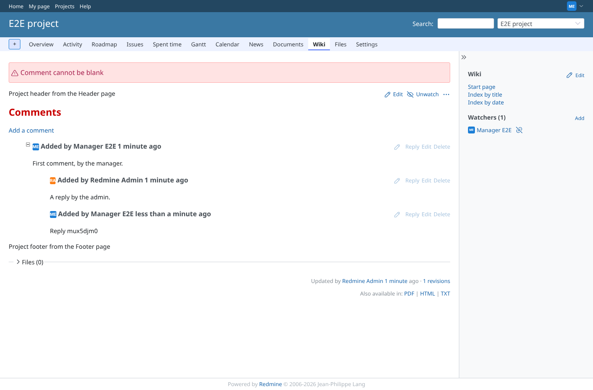
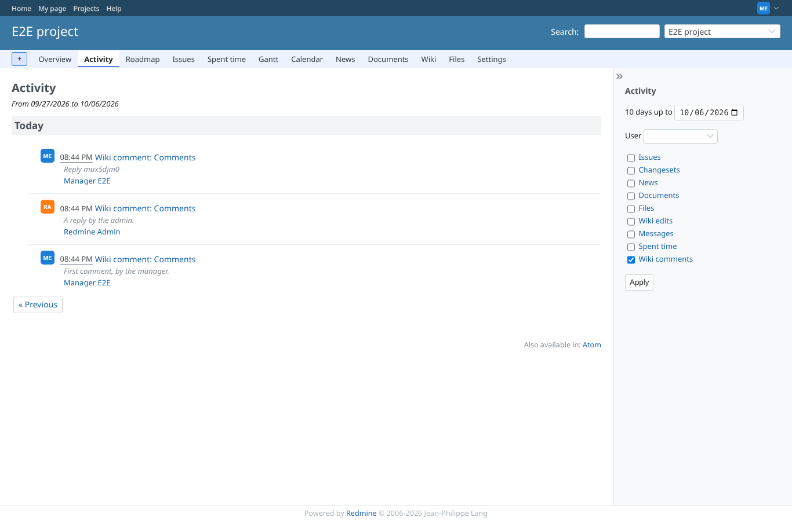
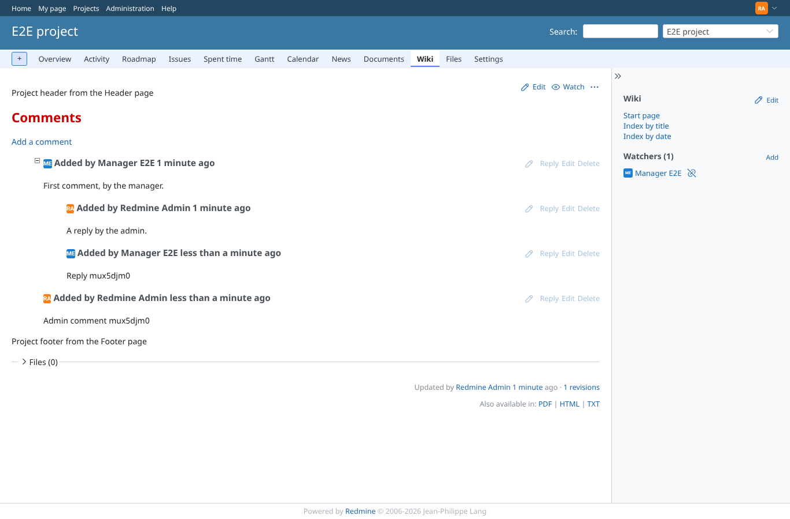
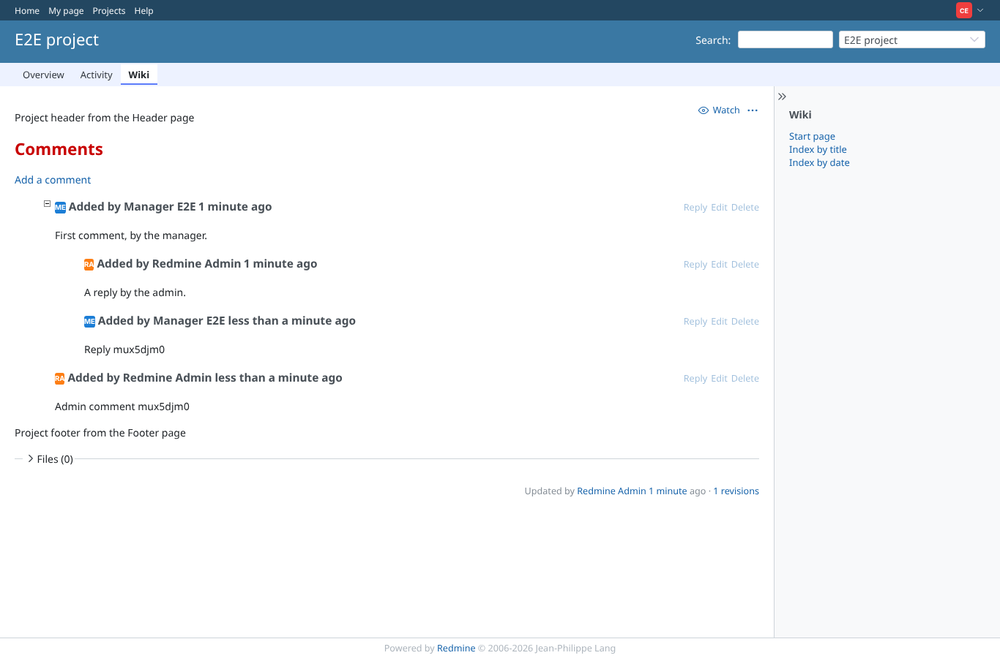
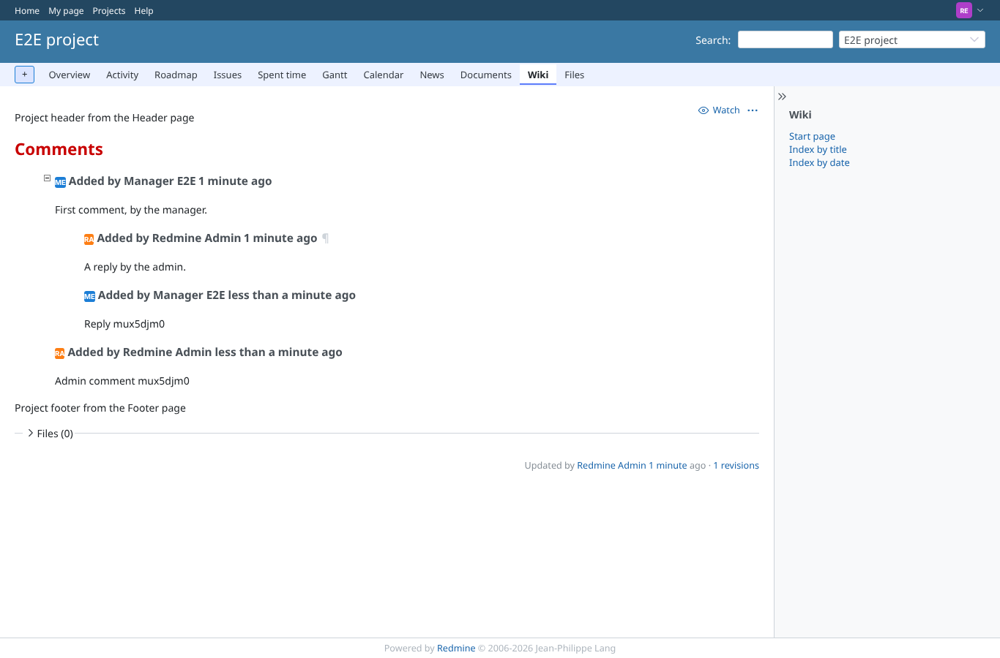

# comments

Run 2026-10-06T20:45:16.783Z against http://127.0.0.1:3000.

| screenshot | user | URL | shows |
|---|---|---|---|
|  | manager | `/projects/e2e-project/wiki/Comments` | The comment form opened from {{comment_form}} with the wiki toolbar (it was missing on CommonMark: "jsToolBar is not defined") |
|  | manager | `/projects/e2e-project/wiki/Comments` | The new comment is listed, its text formatted |
|  | manager | `/projects/e2e-project/wiki/Comments` | The reply is nested under the comment it answers |
|  | manager | `/projects/e2e-project/wiki/Comments` | The edited comment shows the new text |
|  | manager | `/projects/e2e-project/wiki/Comments` | After confirming "Are you sure?" the comment is gone |
|  | manager | `/projects/e2e-project/wiki_extensions/destroy_comment?comment_id=1` | GET /wiki_extensions/destroy_comment is not routed any more: 404, nothing deleted |
|  | manager | `/projects/e2e-project/wiki/Comments` | An empty comment is refused with "Comment cannot be blank" (before: silently dropped, watchers still mailed) |
|  | manager | `/projects/e2e-project/activity?show_wiki_comment=1` | Project activity lists the wiki comments (provider scope now a proc: no deprecation) |
|  | admin | `/projects/e2e-project/wiki/Comments` | Admin's comment is listed; 1 notification mail(s) written for it, one to the watching manager |
|  | commenter | `/projects/e2e-project/wiki/Comments` | commenter (comment permissions only): can add and reply; edit and delete links are shown by permission |
|  | commenter | `/projects/e2e-project/wiki/Comments` | Requests as commenter: edit and delete of the admin's comment 403, add_comment on e2e-private page null through e2e-project 404; the page shows no trace of it |
|  | reporter | `/projects/e2e-project/wiki/Comments` | reporter: reads the comments, gets no form and no reply, edit or delete links |
|  | outsider | `/projects/e2e-private/wiki/Secret` | outsider: the private project wiki is refused (403) |
