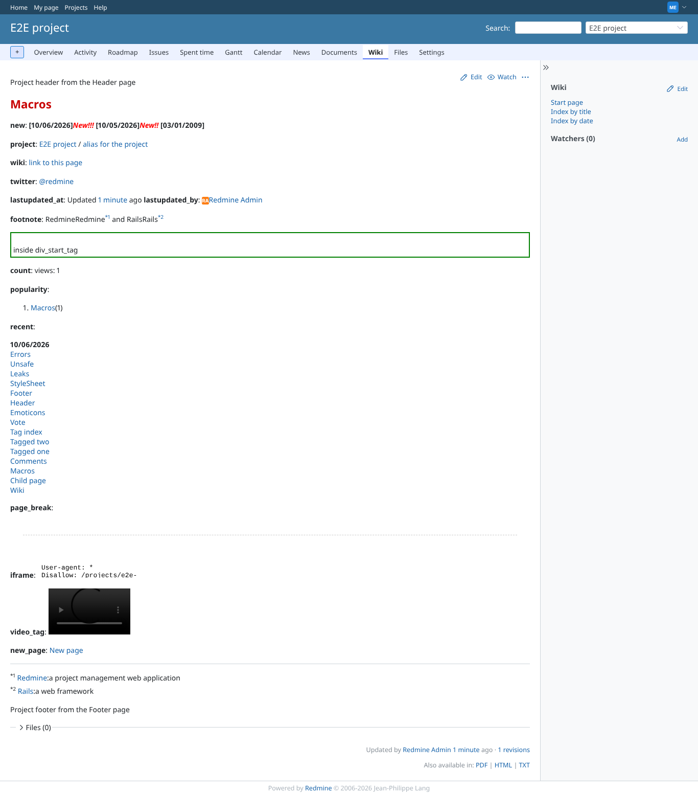
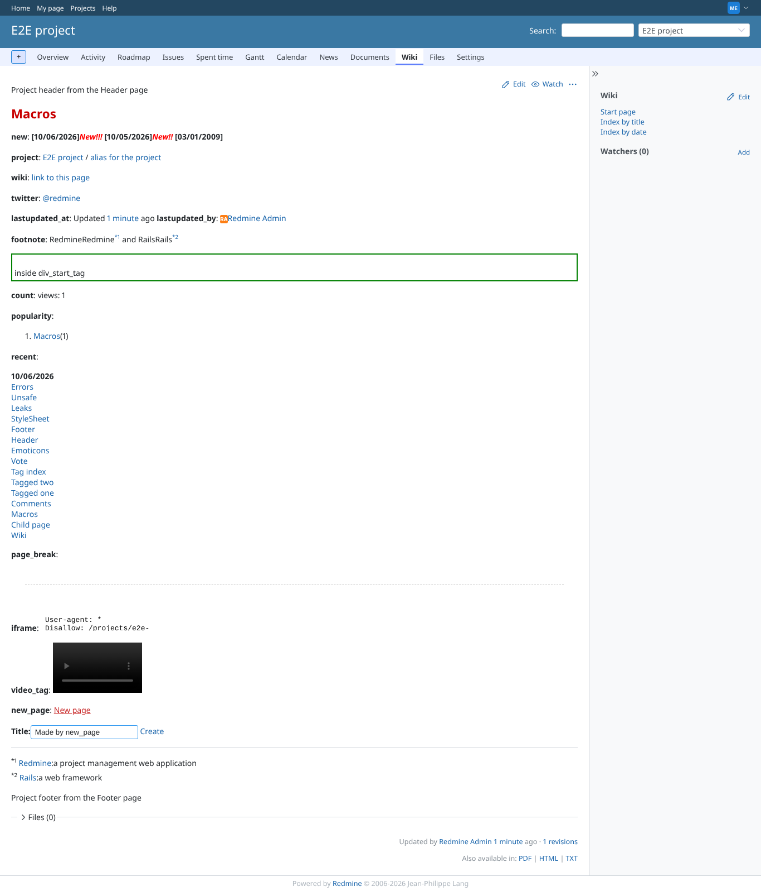
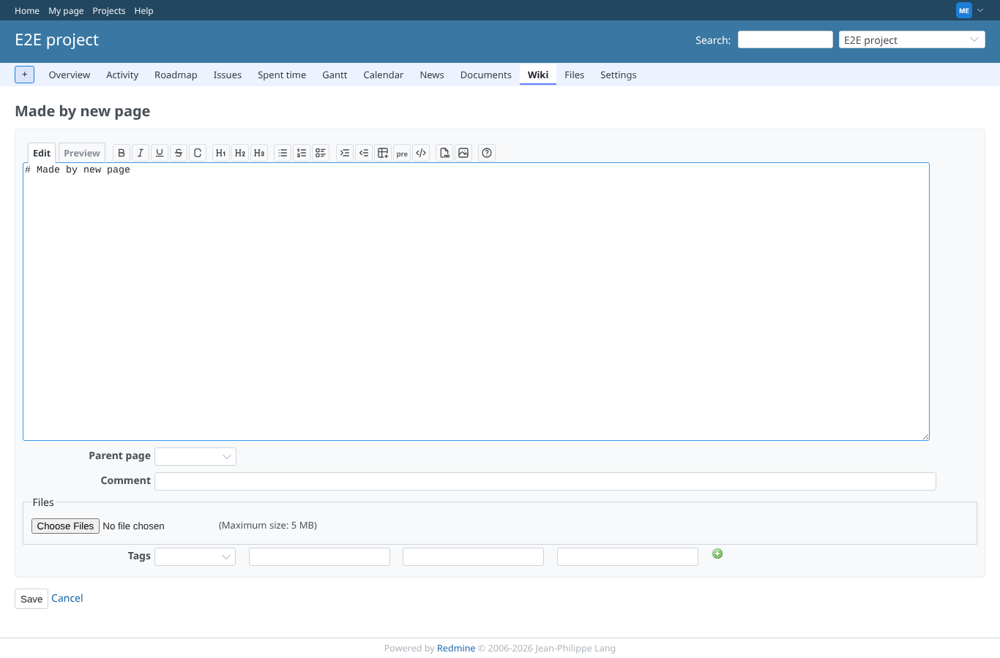
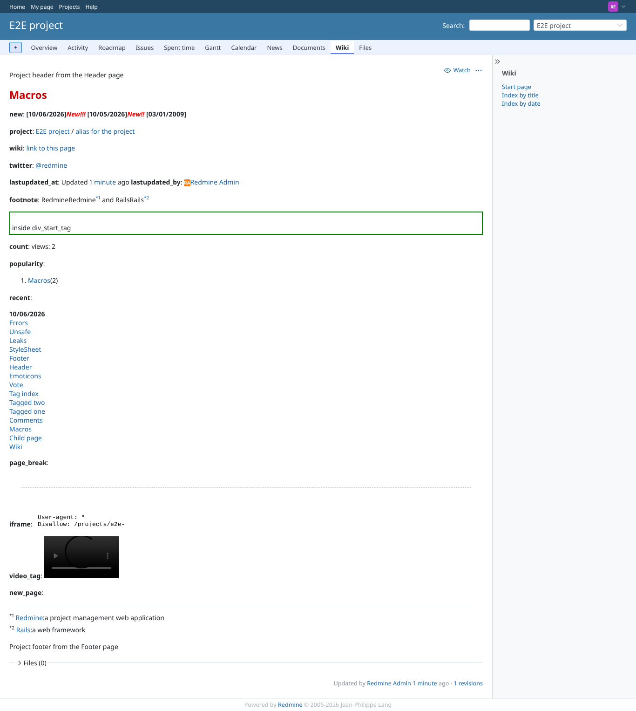
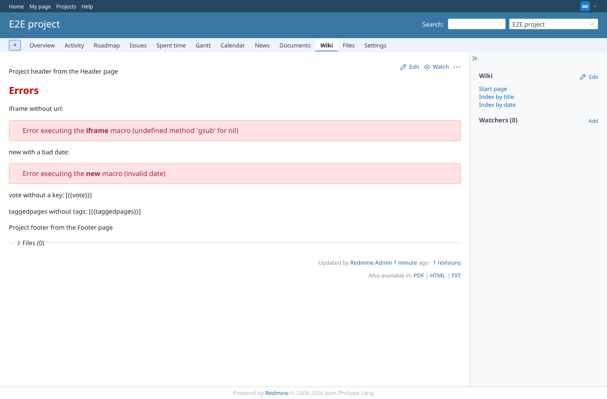

# macros

Run 2026-10-06T20:45:46.278Z against http://127.0.0.1:3000.

| screenshot | user | URL | shows |
|---|---|---|---|
|  | manager | `/projects/e2e-project/wiki/Macros` | Every display macro rendered as manager: new marks, project/wiki/twitter links, last update, footnotes with list, styled div, count (unchanged by a reload in the same session), popularity, recent, page break, iframe, video, new page form |
|  | manager | `/projects/e2e-project/wiki/Macros` | new_page: the link opened the title field |
|  | manager | `/projects/e2e-project/wiki/Made%20by%20new_page` | new_page: Create led to the edit form of the page "Made by new page" |
|  | reporter | `/projects/e2e-project/wiki/Macros` | The same page as reporter (no plugin permissions): display macros render; new_page shows nothing without the wiki edit permission |
|  | anonymous | `/projects/e2e-project/wiki/Macros` | Anonymous on the public project sees the macros as well |
|  | manager | `/projects/e2e-project/wiki/Errors` | Invalid arguments: iframe without URL and new with a bad date show a macro error, vote and taggedpages without arguments render nothing (Redmine then shows the macro text); HTTP 200, no 500 |
