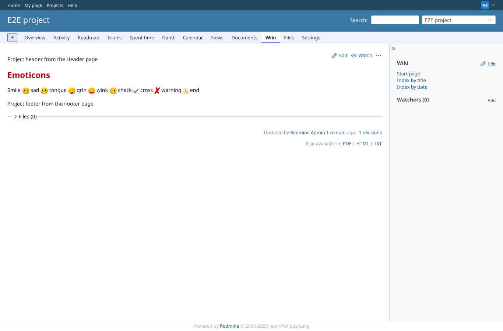
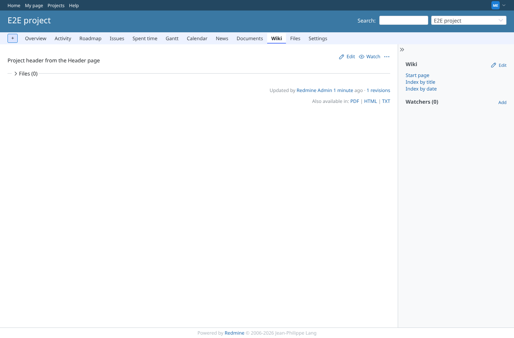
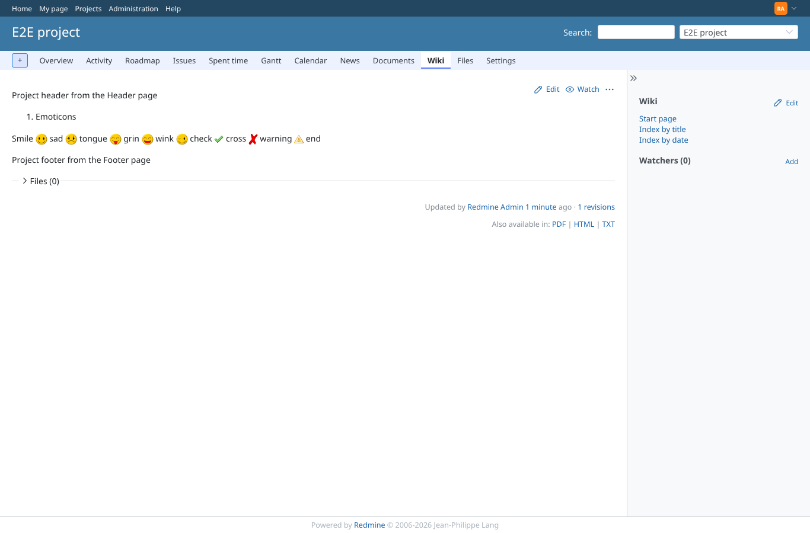

# layout

Run 2026-10-06T20:48:17.155Z against http://127.0.0.1:3001.

| screenshot | user | URL | shows |
|---|---|---|---|
|  | manager | `/projects/e2e-project/wiki/Emoticons` | CommonMark: the eight emoticons are images (all loaded from /wiki_extentions/emoticon/*.png), Header and Footer pages are included, the StyleSheet page colours the title red |
|  | manager | `/projects/e2e-project/wiki/Header` | The Header page itself is shown without header or footer around it |
|  | outsider | `/projects/e2e-private/wiki_extensions/stylesheet.css` | outsider: the StyleSheet of the private project is refused (403); anonymous gets 403 too |
|  | admin | `/projects/e2e-project/wiki/Emoticons` | Textile: the same emoticons are images, Header/Footer included (the header wrapper loses its id here too, so #wiki_extentions_header rules never match) |
