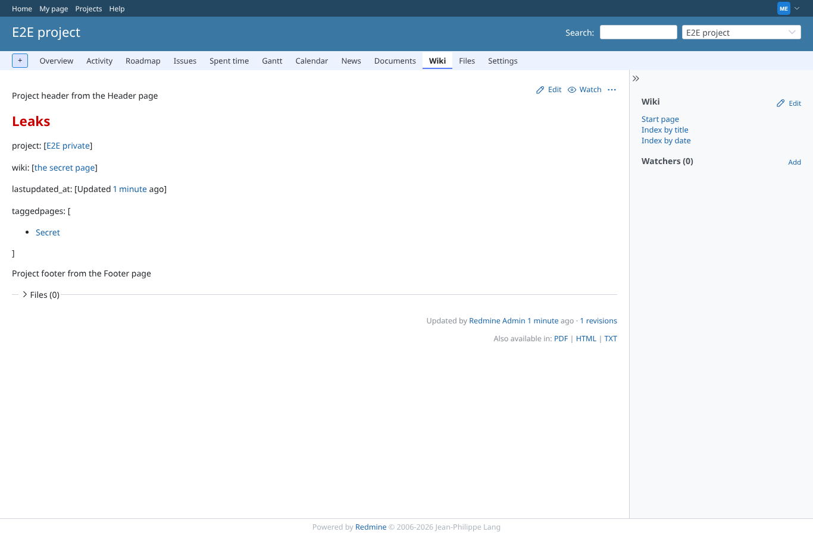
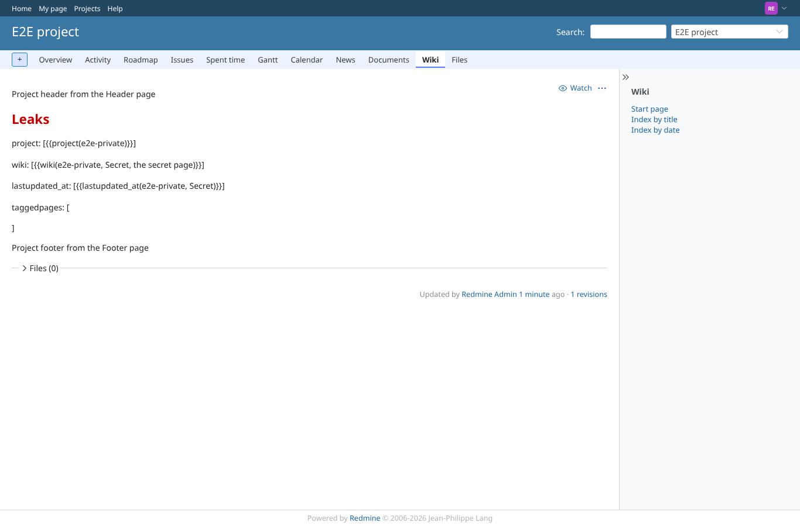
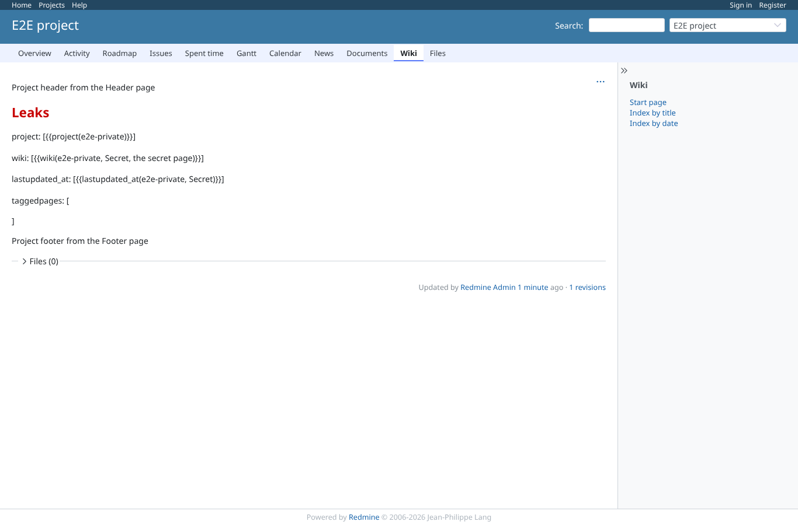
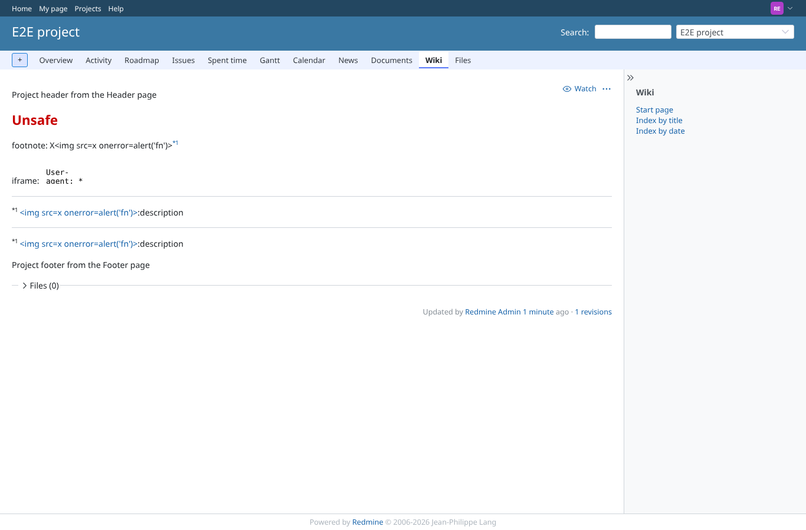

# macro_security

Run 2026-10-06T20:48:25.105Z against http://127.0.0.1:3001.

| screenshot | user | URL | shows |
|---|---|---|---|
|  | manager | `/projects/e2e-project/wiki/Leaks` | manager (member of e2e-private): project, wiki, lastupdated_at and taggedpages(secret-tag, project=all) show the private project and its Secret page |
|  | reporter | `/projects/e2e-project/wiki/Leaks` | reporter: the macros render nothing (Redmine shows their source text): no link into e2e-private, not its name "E2E private", no Secret page in taggedpages, no update time (all were shown before) |
|  | anonymous | `/projects/e2e-project/wiki/Leaks` | anonymous: the macros render nothing (Redmine shows their source text): no link into e2e-private, not its name "E2E private", no Secret page in taggedpages, no update time (all were shown before) |
|  | reporter | `/projects/e2e-project/wiki/Unsafe` | Footnote word  and iframe width 100" onload="alert('iframe') are shown as text / dropped: no image, no onload, no dialog |
