# smoke

Run 2026-10-06T20:22:38.617Z against http://127.0.0.1:3001.

| screenshot | user | URL | shows |
|---|---|---|---|
|  | admin | `/` | / (HTTP 200) |
| 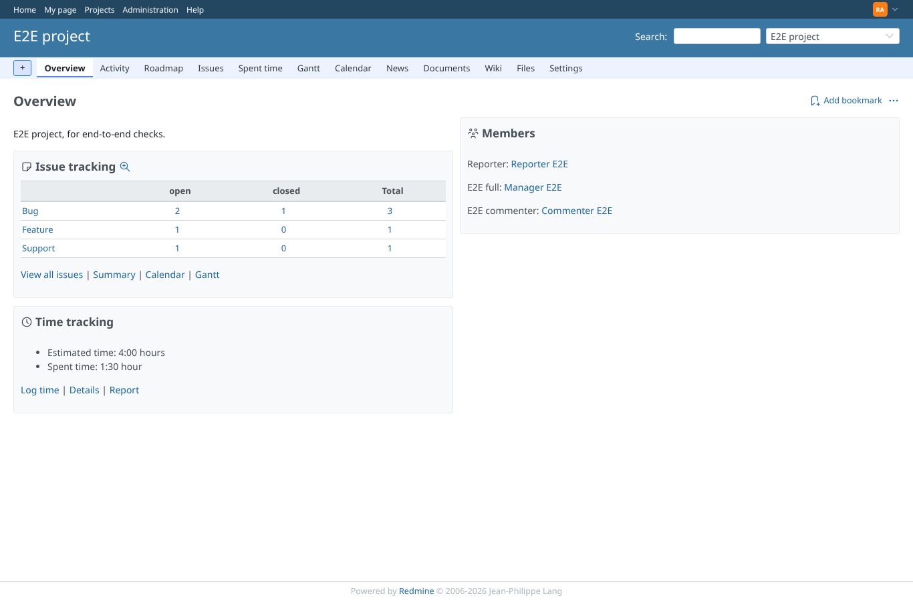 | admin | `/projects/e2e-project` | /projects/e2e-project (HTTP 200) |
| 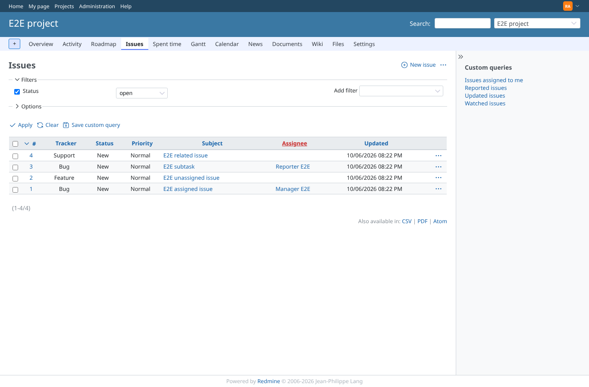 | admin | `/projects/e2e-project/issues` | /projects/e2e-project/issues (HTTP 200) |
| 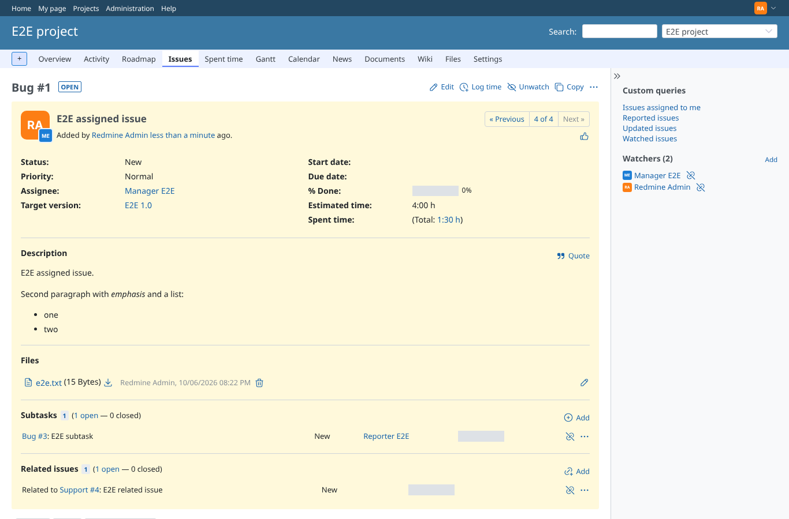 | admin | `/issues/1` | /issues/1 (HTTP 200) |
| 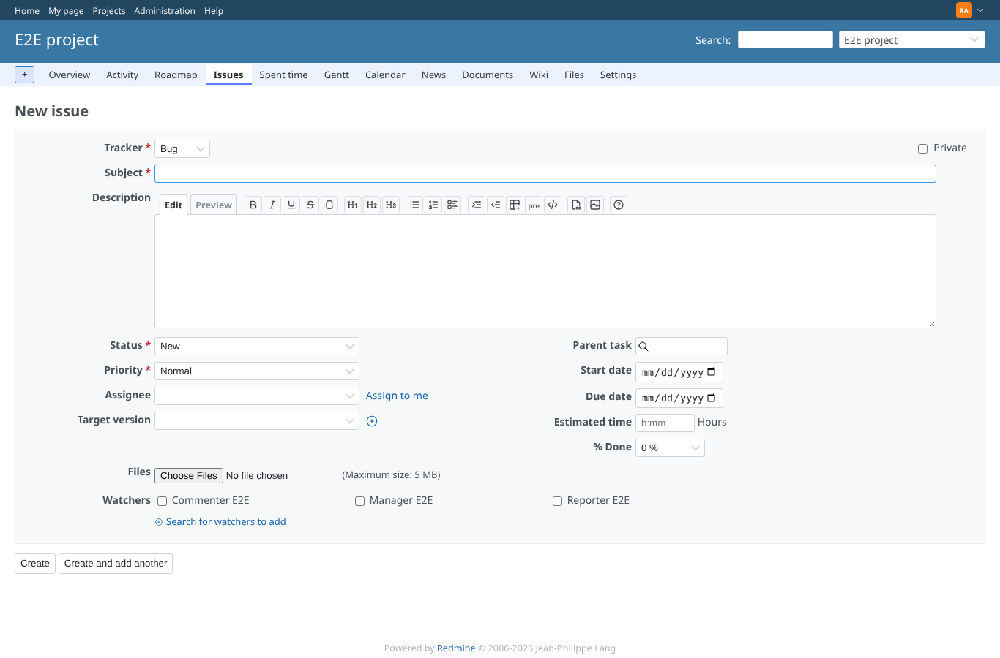 | admin | `/projects/e2e-project/issues/new` | /projects/e2e-project/issues/new (HTTP 200) |
| 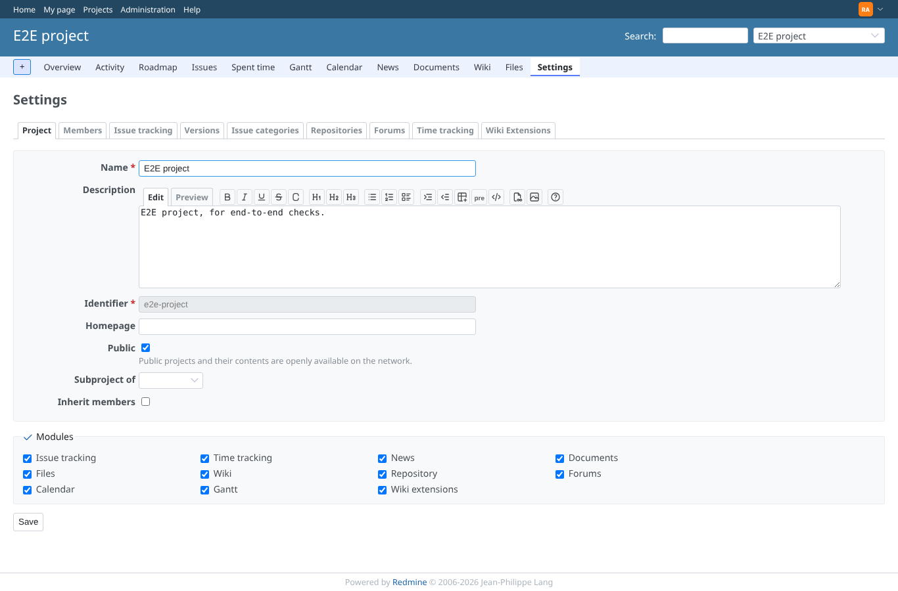 | admin | `/projects/e2e-project/settings` | /projects/e2e-project/settings (HTTP 200) |
| 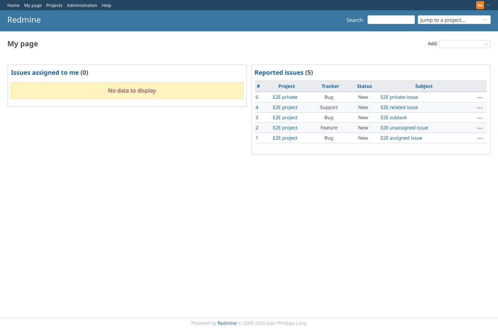 | admin | `/my/page` | /my/page (HTTP 200) |
| 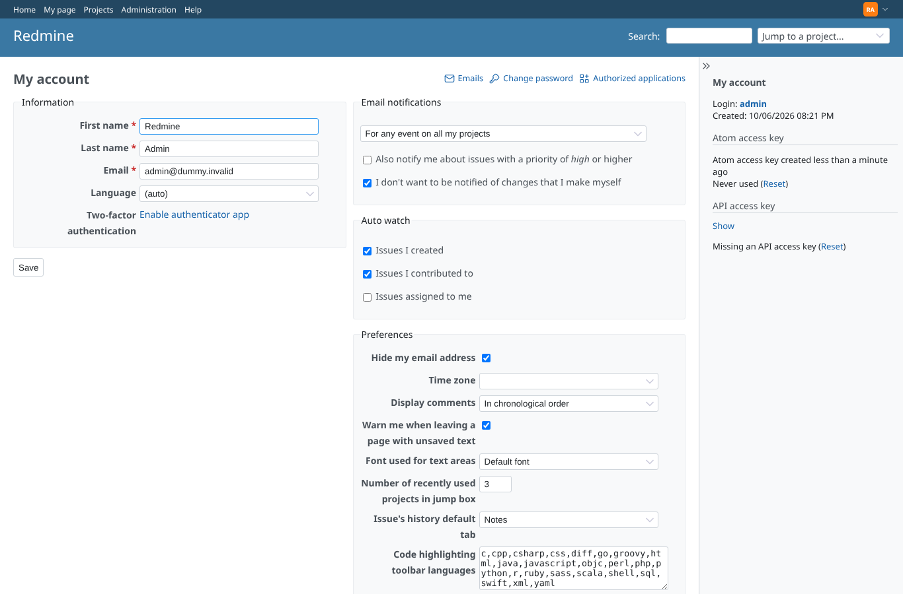 | admin | `/my/account` | /my/account (HTTP 200) |
| 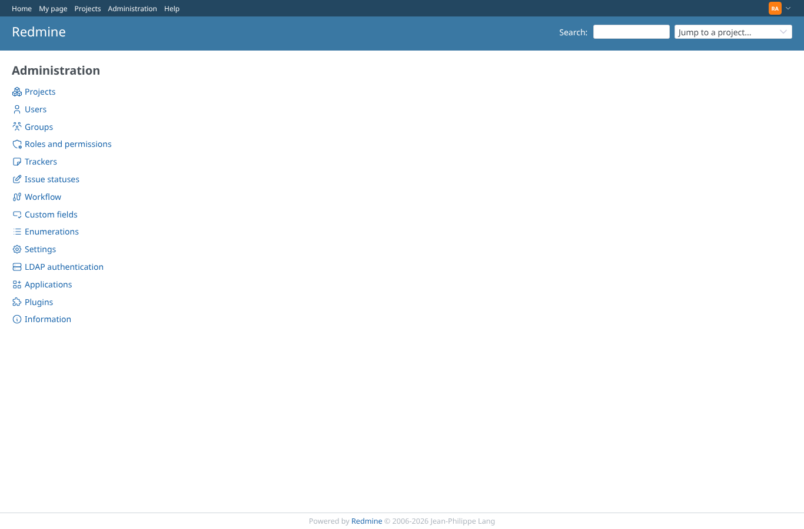 | admin | `/admin` | /admin (HTTP 200) |
| 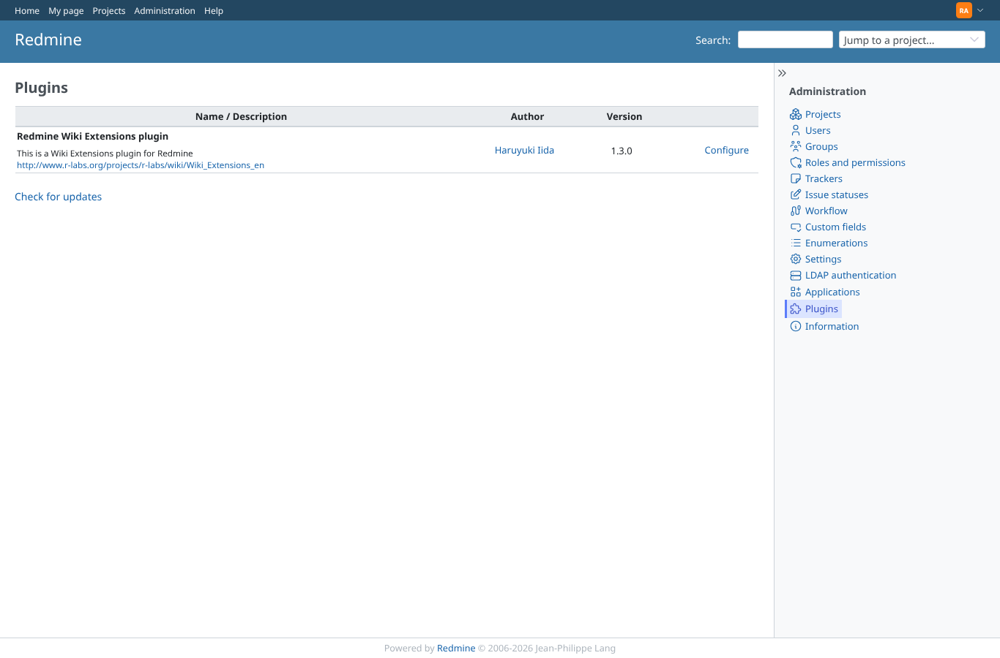 | admin | `/admin/plugins` | /admin/plugins (HTTP 200) |
| 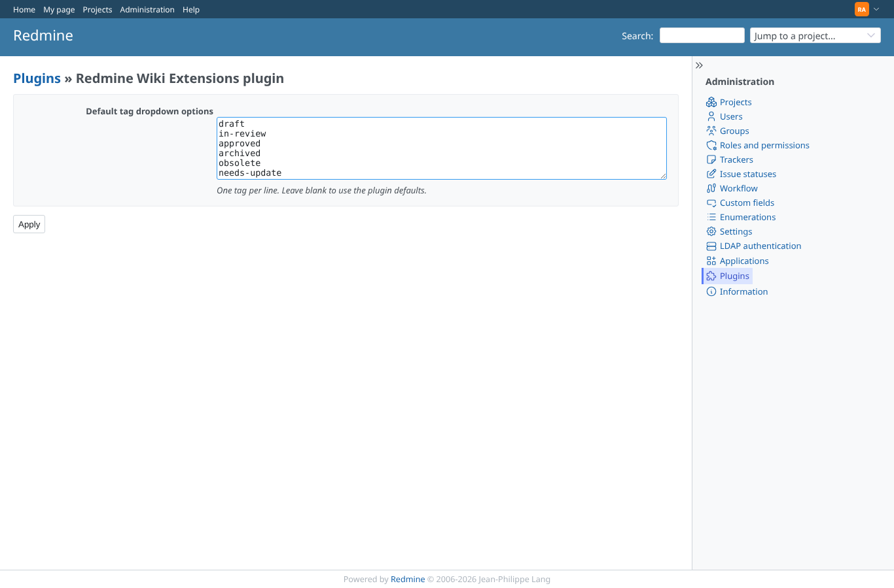 | admin | `/settings/plugin/redmine_wiki_extensions` | /settings/plugin/redmine_wiki_extensions (HTTP 200) |
|  | admin | `/wiki_extentions/emoticon/1` | /wiki_extentions/emoticon/1 (HTTP 404) |
| 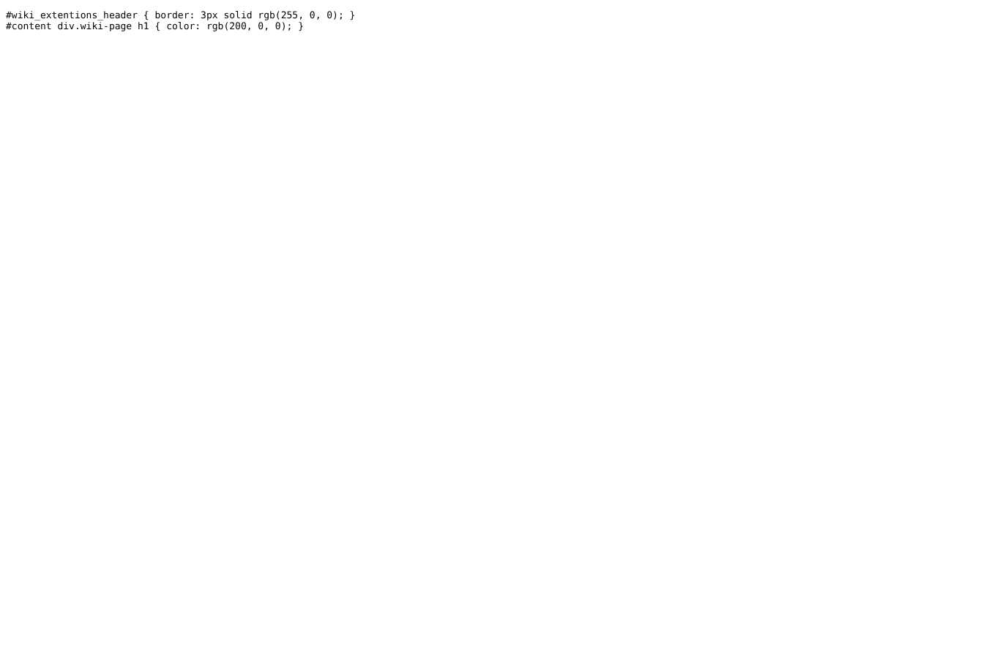 | admin | `/projects/1/wiki_extensions/stylesheet` | /projects/1/wiki_extensions/stylesheet (HTTP 200) |
|  | admin | `/projects/1/wiki_extensions/show_vote` | /projects/1/wiki_extensions/show_vote (HTTP 404) |
| 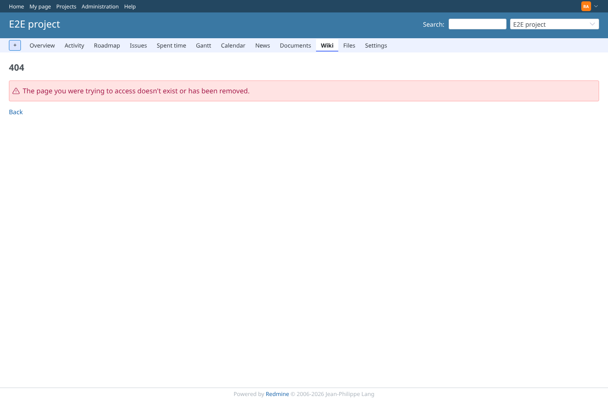 | admin | `/projects/1/wiki_extensions/forward_wiki_page` | /projects/1/wiki_extensions/forward_wiki_page (HTTP 404) |
|  | admin | `/projects/1/wiki_extensions/show_comments` | /projects/1/wiki_extensions/show_comments (HTTP 404) |
|  | admin | `/projects/1/wiki_extensions/tag` | /projects/1/wiki_extensions/tag (HTTP 404) |
|  | admin | `/projects/1/wiki_extensions_settings` | /projects/1/wiki_extensions_settings (HTTP 404) |
