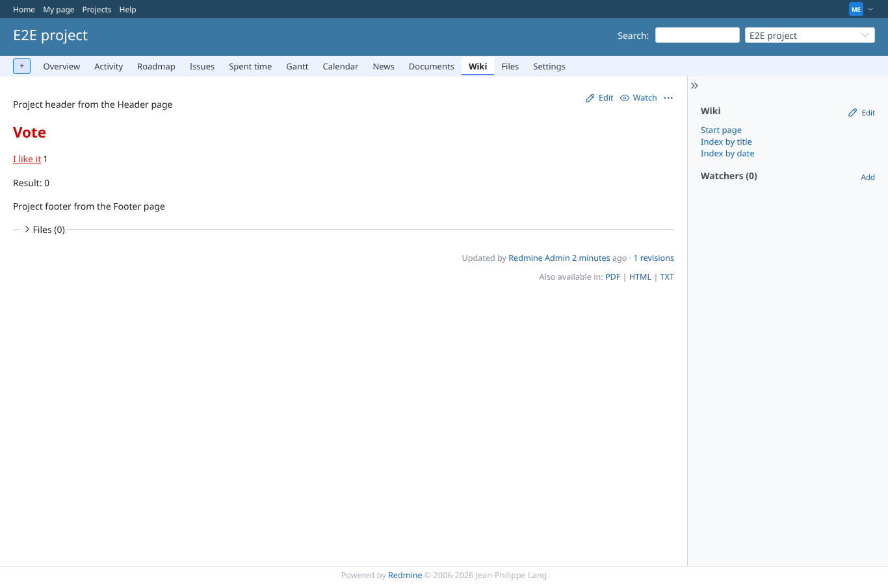
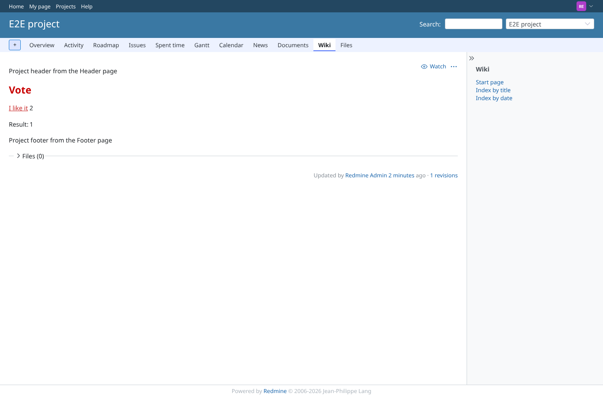
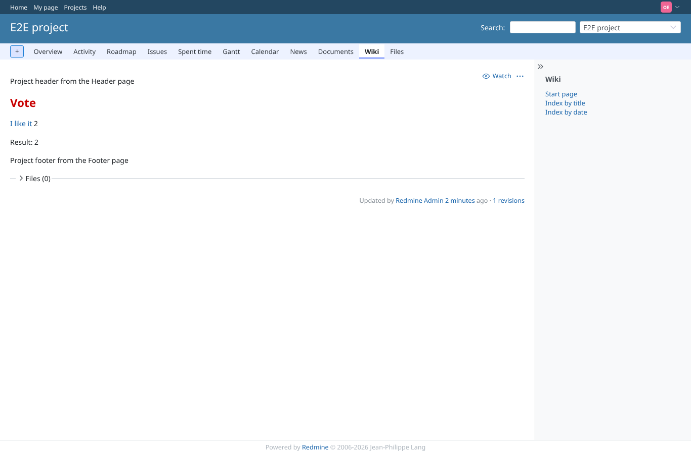

# vote

Run 2026-10-06T20:49:26.945Z against http://127.0.0.1:3001.

| screenshot | user | URL | shows |
|---|---|---|---|
|  | manager | `/projects/e2e-project/wiki/Vote` | manager clicked "I like it": POST /wiki_extensions/vote answered 200, the count went from 0 to 1 |
|  | manager | `/projects/e2e-project/wiki/Vote` | After a second click and a reload {{show_vote}} still shows one more vote: one vote per session |
|  | reporter | `/projects/e2e-project/wiki/Vote` | reporter (no plugin permissions) can vote: the permission is public |
|  | reporter | `/projects/e2e-project/wiki_extensions/vote?target_class_name=WikiContent&target_id=1&key=like` | GET /wiki_extensions/vote is not routed: 404 (what every vote click got before the fix) |
|  | outsider | `/projects/e2e-project/wiki/Vote` | outsider: POST /projects/e2e-private/wiki_extensions/vote answered 403 |
