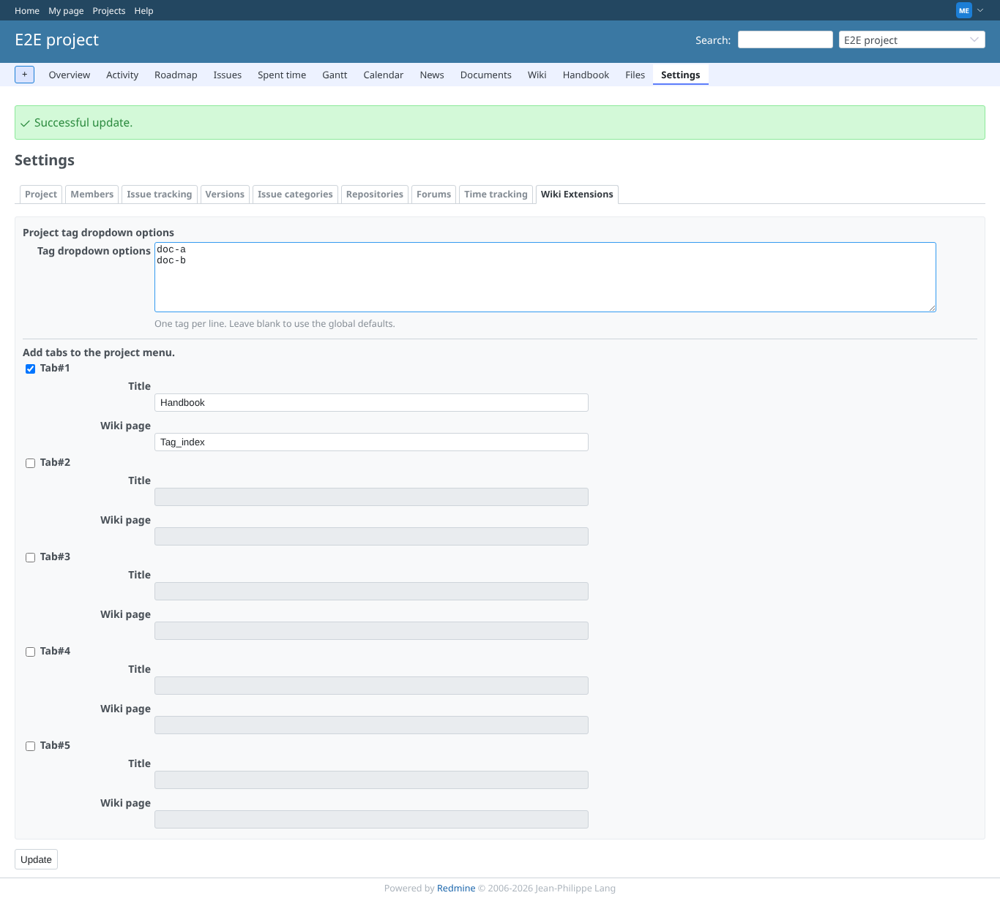
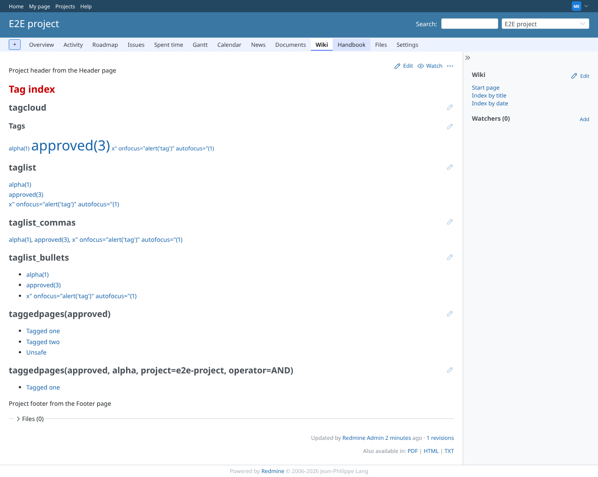
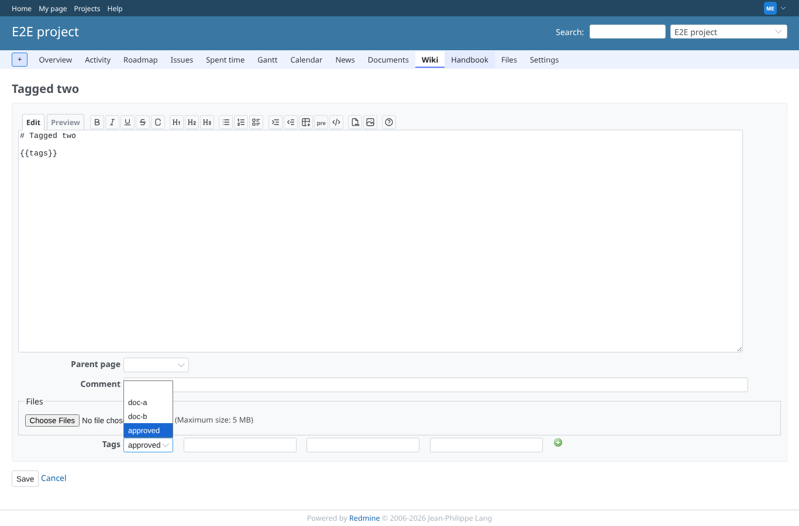
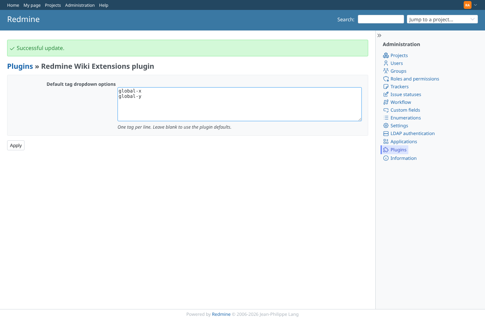
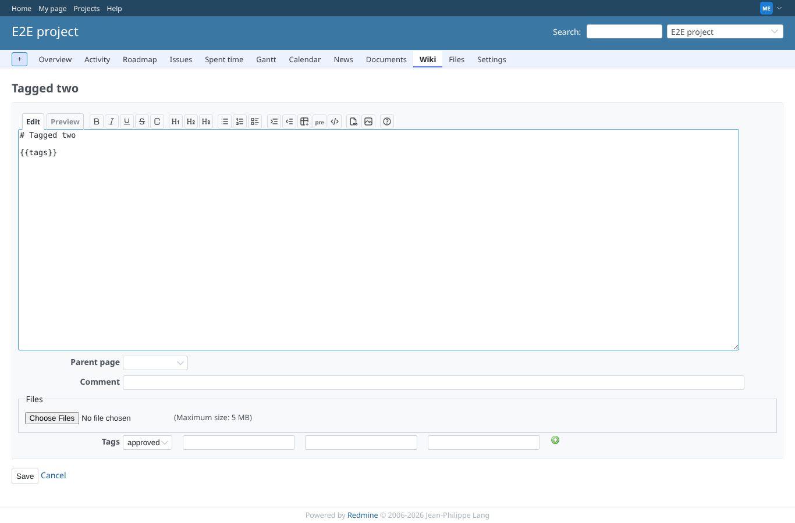
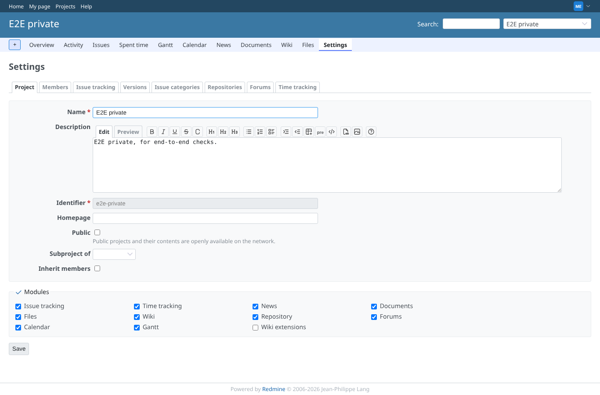

# settings

Run 2026-10-06T20:46:12.813Z against http://127.0.0.1:3000.

| screenshot | user | URL | shows |
|---|---|---|---|
|  | manager | `/projects/e2e-project/settings/wiki_extensions` | manager saved the project tab: dropdown options doc-a/doc-b and menu tab #1 "Handbook" -> page Tag_index ("Successful update."); exactly Tab#1 to Tab#5 (a stray Tab#0 showed up before) |
|  | manager | `/projects/e2e-project/wiki/Tag_index` | The project menu shows "Handbook"; clicking it went through forward_wiki_page to the Tag_index page |
|  | manager | `/projects/e2e-project/wiki/Tagged_two/edit` | The first tag field offers the project options doc-a and doc-b, plus "approved" because the page carries it |
|  | reporter | `/projects/e2e-project/settings/wiki_extensions` | reporter: follows the "Handbook" tab, but the project settings are refused (403) |
|  | outsider | `/projects/e2e-private/wiki_extensions/forward_wiki_page?menu_id=1` | outsider: settings and menu tabs of the private project are refused (403) |
|  | admin | `/settings/plugin/redmine_wiki_extensions` | Administration > Plugins > Wiki Extensions: plugin-wide dropdown options set to global-x/global-y |
|  | manager | `/projects/e2e-project/wiki/Tagged_two/edit` | With the project options emptied, the first tag field offers the plugin-wide options; the menu tab is gone again |
|  | manager | `/projects/e2e-private/settings` | Module "Wiki extensions" disabled in e2e-private: no Wiki Extensions settings tab (and no tag fields on the edit form) |
