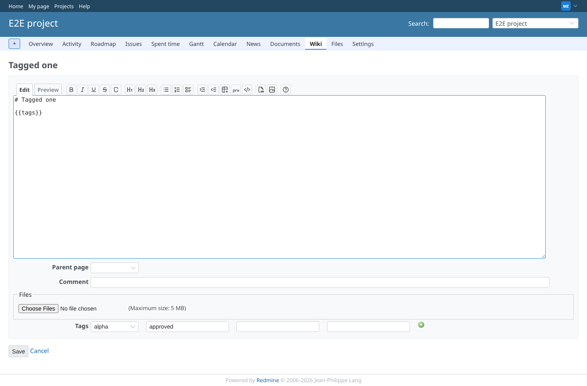
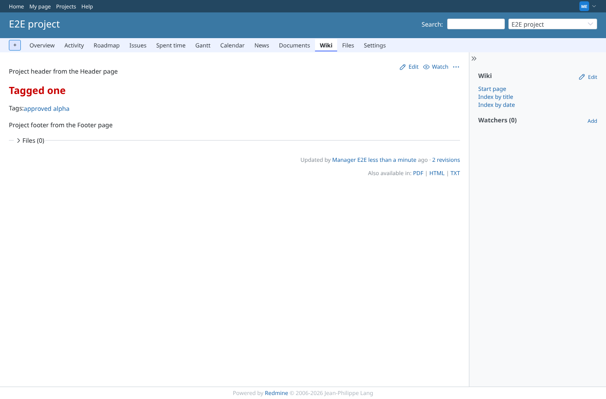
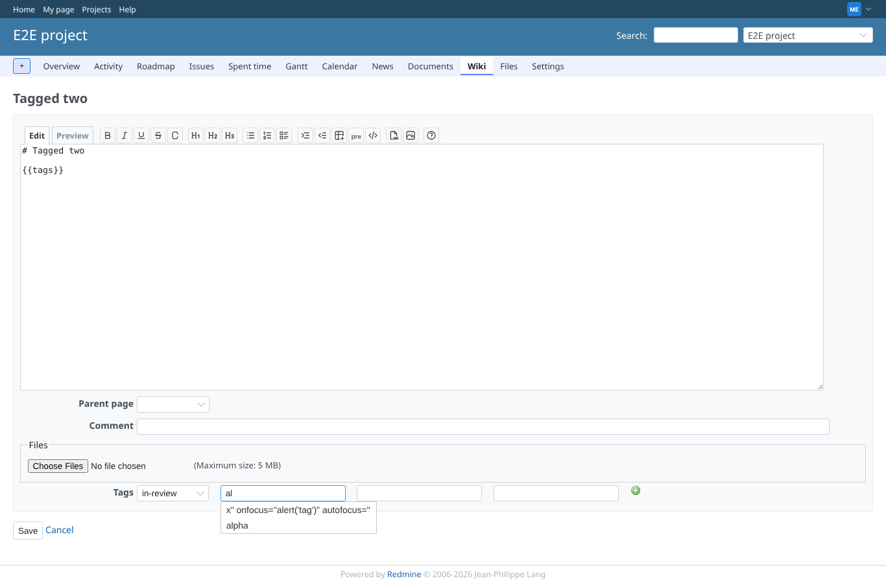
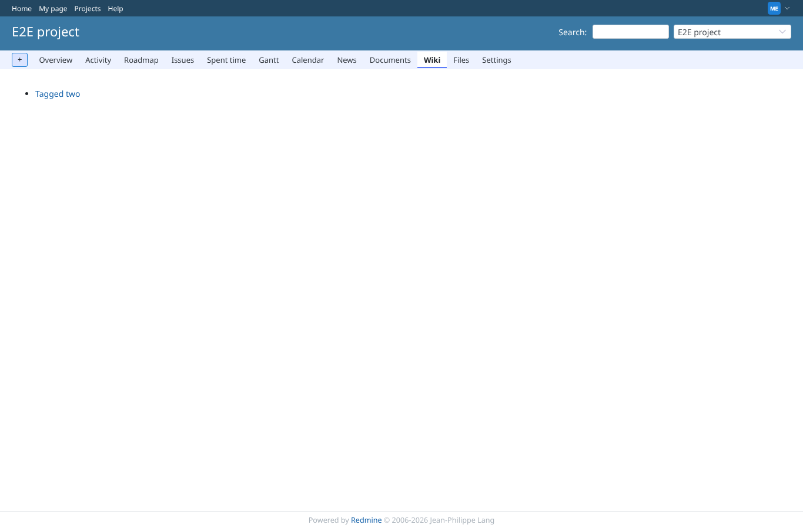
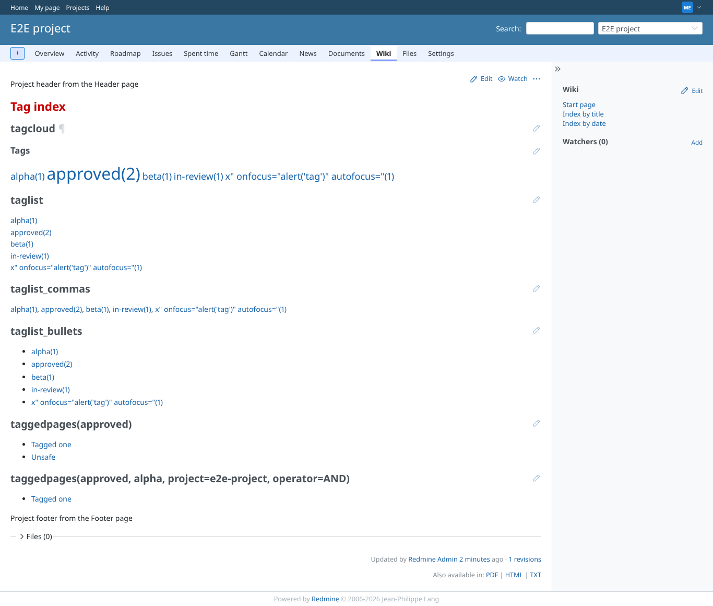
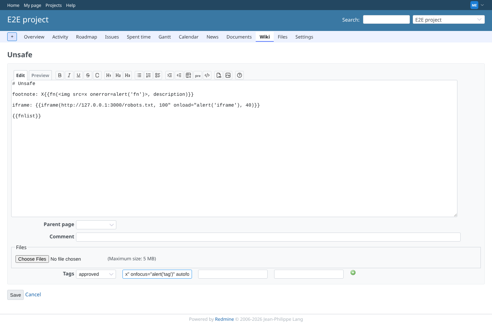
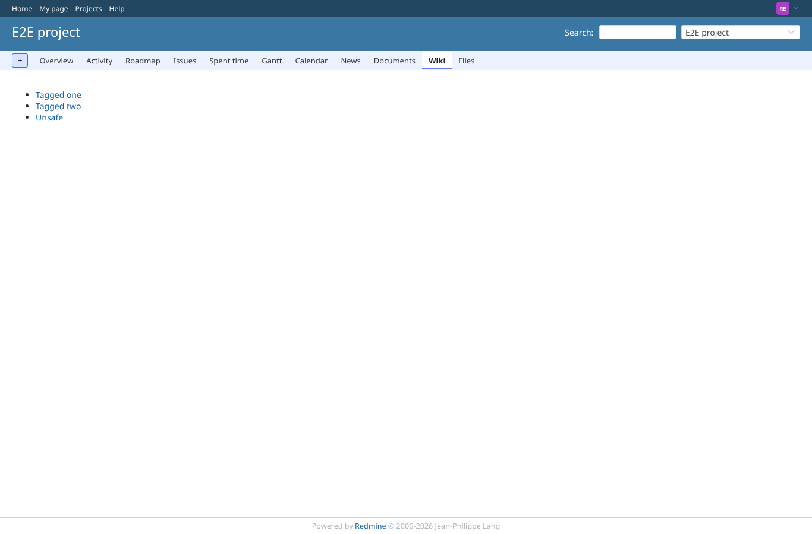
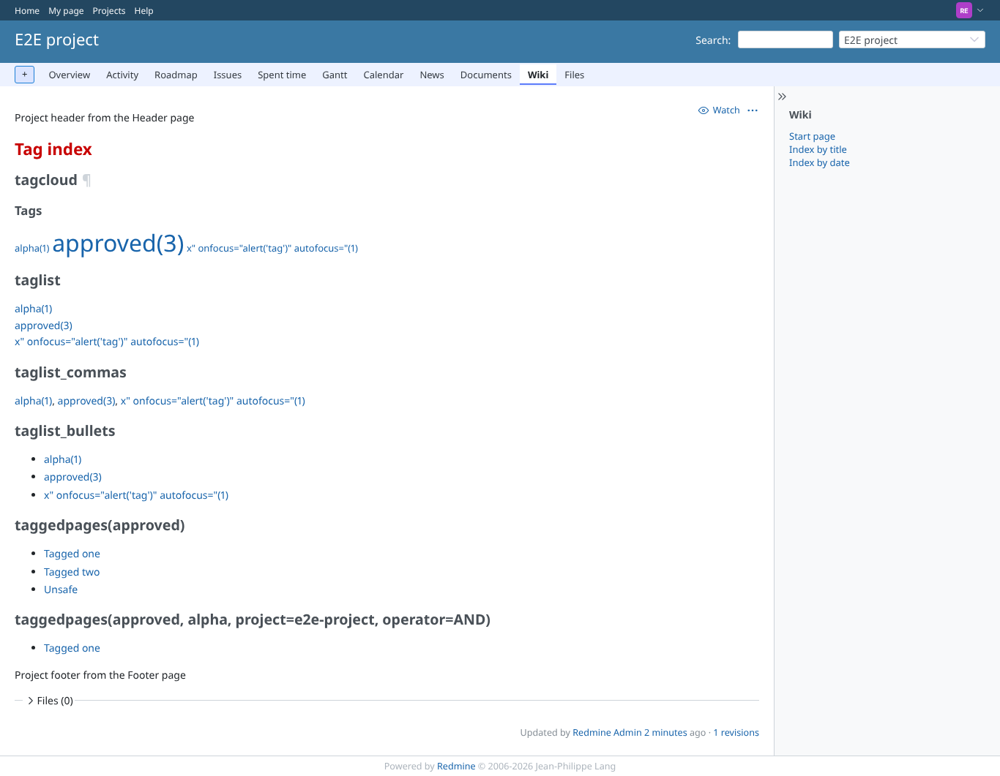

# tags

Run 2026-10-06T20:17:04.158Z against http://127.0.0.1:3000.

| screenshot | user | URL | shows |
|---|---|---|---|
|  | manager | `/projects/e2e-project/wiki/Tagged_one/edit` | Edit form of Tagged_one: the dropdown keeps "alpha" (not an option; it used to fall back to blank and be deleted on save), "approved" in the next field |
|  | manager | `/projects/e2e-project/wiki/Tagged_one` | {{tags}} after saving the form unchanged: alpha and approved are both still there |
|  | manager | `/projects/e2e-project/wiki/Tagged_two/edit` | Typing "al" in a free tag field suggests the existing tag "alpha" (jQuery UI autocomplete); the dropdown is set to "in-review" |
|  | manager | `/projects/e2e-project/wiki/Tagged_two` | Tagged_two now carries "in-review" (dropdown) and "beta" (free text) |
|  | manager | `/projects/e2e-project/wiki_extensions/tag?tag_id=7` | The tag page of "beta" lists the page that carries it |
|  | manager | `/projects/e2e-project/wiki/Tag_index` | tagcloud, taglist, taglist_commas, taglist_bullets and taggedpages (OR and AND) on one page |
|  | manager | `/projects/e2e-project/wiki/Unsafe/edit` | A tag named x" onfocus="alert('tag')" autofocus=" is shown as text in its field; focusing it runs nothing (it used to become an onfocus handler) |
|  | reporter | `/projects/e2e-project/wiki_extensions/tag?tag_id=1` | reporter: tags and the tag page are visible (show_wiki_tags is a public permission) |
|  | reporter | `/projects/e2e-project/wiki/Tag_index` | reporter, GET /projects/e2e-project/wiki_extensions/tag?tag_id=1..12: 1:200 2:404 3:404 4:200 5:200 6:404 7:404 8:404 9:404 10:404 11:404 12:404; 404 for tags of other projects, the private page is never listed |
|  | outsider | `/projects/e2e-private/wiki_extensions/tag?tag_id=1` | outsider: the tag page of the private project is refused (403); anonymous is sent to the login page |
